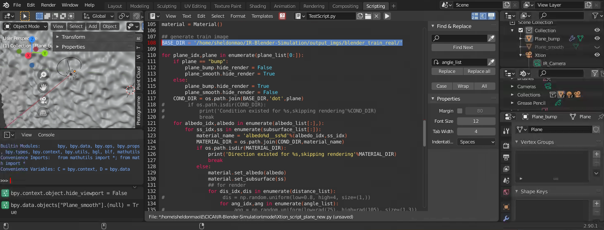

# Surface Material Perception

This is the official repository for IEEE JSTSP paper ["Surface Material Perception Through Multimodal Learning"](https://ieeexplore.ieee.org/document/9772950). 


## Start up
----
conda is recommended to install pytorch with cuda. The rest of used libraries is listed in `requirements.txt`. The code is tested on pytorch 1.10 with cuda 11.3.
````
conda install pytorch torchvision torchaudio cudatoolkit=11.3
pip install -r requirements.txt
````
Training script:
```
bash bash_train.sh
```
By running this training code, the testing is automatically perfromed and the result is saved in `out_dir/test_cm` by default. In addition, the PCA analysis of the embedded feature is stored in this folder. There are several keys to be noticed:

>`model`: [feature-wise] fusion or [channel-wise] fusion, by default is `FeatureFusion`. <br>
>`dataset_mode`: loading data from BlenderDataset or CaptureDataset, by default is `BlenderDataset`.<br>
>`data_dir`: the root direction for the specific dataset. Should include `test` and `train` direction as described in the following section.

## Data Description:
-----
The data is available from [here](https://pan.baidu.com/s/1GmNzTH2d5YQHo2ij6qmSWg?pwd=g880). Notice the data format for different dataset sources are different.
### Data for BlenderDataset
Basic unit for blender data files are `xxx_ir.npy` and `xxx_geo.npy`. Directly being post processed already. 

> `xxx_ir.npy`: numpy.ndarray with dimension (H,W,C)1024x1280x3, 3 channels are for dot / diffusion / real channels respectively. <br>
>`xxx_geo.npy`: numpy.ndarray with dimension (H,W,C)256x320x3, 3 channels are for raw depth / <n,w> / radius respectively. All channels are downsampled 4x.

To generate the synthesized data yourself, users are referred to [Xtion Project](./blender_model). Notice the BASE_DIR should be assigned to generate the data.



### Data for CaptureDataset
basic unit for capture data files are `xxx_color.png`,`xxx_depth.png` and `xxx_ir.png`.
> `xxx_color.png`: uint8 RGB image with dimension (H,W) 1024x1280.  <br>
>`xxx_depth.png`: uint16 gray image with (H,W) 240x320, align with color image in upper part, raw values measure depth in mm. <br>
>`xxx_ir.png`: uint16 gray image with (H,W) 1024x1280, an alignment is needed to map color image onto the IR image.
